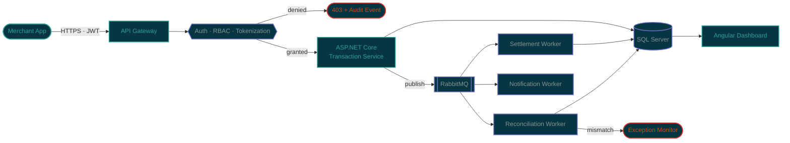

<div align="center">


<a href="https://github.com/EFTEKHER">

</a>

<br/>

[](https://eftekheralieftecom.vercel.app/)
[](https://linkedin.com/in/eftekher-ali-efte-589a82299)
[](https://codeforces.com/profile/dont_love_anyone)
[](mailto:eftekherali2000@gmail.com)


</div>

## `>` boot.sequence

```ansi
[ OK ]  Initializing EFTEKHER.PROFILE v2026.8
[ OK ]  Mounting /dev/dotnet ................ ASP.NET Core 8
[ OK ]  Mounting /dev/angular ............... v20
[ OK ]  Establishing SQL Server connection .. 1433/tcp OPEN
[ OK ]  Binding RabbitMQ exchanges .......... 5672/tcp OPEN
[ OK ]  Loading OWASP + JWT/RBAC modules .... SECURE
[ OK ]  Spawning n8n automation agents ...... 3 workers
[WARN]  Caffeine reserves ................... LOW
[ OK ]  System ready. Awaiting transactions.
```

## `>` whoami

```csharp
namespace Eftekher.Profile;

public sealed class Engineer : ISoftwareEngineer
{
    public string Name     => "Eftekher Ali Efte";
    public string Role     => "Software Engineer @ Easy Payment Solution (EPS)";
    public string Base     => "Dhaka, Bangladesh";
    public string Degree   => "B.Sc. CSE — RUET (2020–2025)";

    public string[] Domains => [
        "Payment Gateways", "Merchant Onboarding & KYC",
        "Settlement & Reconciliation", "Bank IT / FinTech"
    ];

    public string[] CoreStack => [
        "C#", "ASP.NET Core", "EF Core", "Angular", "SQL Server", "RabbitMQ"
    ];

    public string Philosophy => "In FinTech, correctness is not negotiable.";
}
```

I build payment gateway and merchant systems that process **thousands of transactions daily** — ASP.NET Core REST APIs for transaction routing and fund transfer, RabbitMQ-backed asynchronous workflows with retries and audit trails, and Angular operational dashboards. Every layer is designed around OWASP controls, JWT/RBAC, tokenization, and secure logging.

Alongside that, I build AI agents and automation pipelines with n8n, webhooks, and LLM APIs.

<details>
<summary><b>🧩 What a transaction actually looks like on my side of the wire</b></summary>
<br/>



Retries, idempotency keys, and audit trails at every hop — a payment that half-happens is worse than one that never started.

</details>


## `>` arsenal

<div align="center">

**Core — .NET & Data**


<br/>

**Languages & Frameworks**


<br/>

**Data · Messaging · Cloud · DevOps**


<br/>

**AI & Automation**


</div>

> **Security & Engineering** — OWASP · JWT · RBAC · Encryption · Tokenization · Audit Logging · Microservices · System Design · CI/CD · DSA


## `>` deployed.systems

<table>
<tr>
<td width="50%" valign="top">

### 🟢 EPS Merchant Onboarding System
Enterprise platform for merchant registration, KYC, document verification, approval workflows, dashboards, and payment integration with secure role-based access.

`Angular 20` `ASP.NET Core` `SQL Server` `JWT`

[**→ Live**](https://merchant.eps.com.bd/) · [Repo 🔒](https://github.com/asifuddaula-eps/MerchantOnboardingPanel_UI)

</td>
<td width="50%" valign="top">

### 🟢 EPS Self Merchant Onboarding Portal
Self-service portal for business registration, OTP verification, KYC completion, document upload, and real-time application tracking.

`Angular` `ASP.NET Core` `SQL Server` `REST API`

**→ Live** (internal)

</td>
</tr>
<tr>
<td width="50%" valign="top">

### 🟢 EPS HR Attendance Management
Enterprise HR platform handling attendance, leave, shifts, holidays, RBAC, dashboards, and reporting on SQL Server.

`Razor Pages` `EF Core` `SQL Server`

**→ Live** (internal)

</td>
<td width="50%" valign="top">

### ⚙️ ASP.NET Core Inventory System
Full-stack inventory application with secure REST APIs, RBAC, audit trails, validation, reporting, and Azure deployment.

`C#` `ASP.NET Core 8` `EF Core` `Azure`

</td>
</tr>
<tr>
<td width="50%" valign="top">

### 🤖 AI Automation Workflows
Webhook- and API-driven automations covering data processing, notifications, orchestration, and AI-agent integration.

`n8n` `Zapier` `LLM APIs`

</td>
<td width="50%" valign="top">

### 🛰️ Padma Bina Pty Ltd
AI-driven land-surveying platform with interactive 3D visualization and digital mapping workflows.

`React` `Three.js` `Node.js` `MongoDB`

</td>
</tr>
<tr>
<td width="50%" valign="top">

### ⚖️ Legal Empowerment Bangladesh
Secure multilingual legal-content platform with authentication and structured content delivery.

`React` `Tailwind` `Firebase`

</td>
<td width="50%" valign="top">

### 🧬 ML Suite — Diabetes & Stock Prediction
Risk prediction with personalized diet recommendations, plus a forecasting app combining statistical and deep-learning models.

`Scikit-learn` `PyTorch` `Prophet` `Flask`

</td>
</tr>
</table>

<sub>🔒 private repository — access on request.</sub>


## `>` timeline

| | Role | Organization | Period |
|:--:|---|---|---|
| 🟢 | **Software Engineer** | Easy Payment Solution (EPS) — Dhaka | `Jan 2026 – Present` |
| ◼️ | **Research Assistant** | Grihayan Limited — Dhaka | `Oct 2025 – Dec 2025` |
| ◼️ | **Trainee Software Engineer** | Inteacc Softech Solutions — Dhaka | `Jul 2025 – Dec 2025` |
| ◼️ | **Senior Web Developer** *(Contract)* | Legal Empowerment Bangladesh — Remote | `2024` |
| ◼️ | **Junior SWE Fellow** | Headstarter AI — USA | `2024` |
| 🟣 | **Founder** | Binary2AI | `—` |

**Currently at EPS:** designing ASP.NET Core APIs for transaction routing, balance inquiry, fund transfer, merchant onboarding and KYC · building RabbitMQ async workflows with monitoring, retries and audit trails · shipping Angular dashboards that cut manual processing effort by **~40%** · automating settlement, reconciliation and exception monitoring.


## `>` telemetry

<div align="center">


<br/><br/>

<picture>
  <source
    srcset="https://github-readme-streak-stats.herokuapp.com/?user=EFTEKHER&hide_border=true&background=002B36&stroke=073642&ring=2AA198&fire=CB4B16&currStreakLabel=2AA198&sideNums=93A1A1&sideLabels=839496&dates=586E75&border_radius=10"/>
  
</picture>

<br/><br/>


<br/>

</div>


### focus.distribution

```
.NET / C# / ASP.NET Core   ███████████████████████░░   BACKEND CORE
SQL Server / T-SQL         █████████████████████░░░░   DATA LAYER
Angular / TypeScript       ███████████████████░░░░░░   FRONTEND
RabbitMQ / Async Workflows █████████████████░░░░░░░░   MESSAGING
Security · OWASP/JWT/RBAC  █████████████████░░░░░░░░   HARDENING
n8n / LLM APIs / Agents    ███████████████░░░░░░░░░░   AUTOMATION
Python / ML                ████████████░░░░░░░░░░░░░   ANALYTICS
Java / Spring Boot         ██████████░░░░░░░░░░░░░░░   SECONDARY
C++ / DSA                  ██████████░░░░░░░░░░░░░░░   COMPETITIVE
```

<sub>Where my hours actually go — not a byte count of public repos.</sub>


## `>` credentials

<details>
<summary><b>🎓 Education</b></summary>
<br/>

- **B.Sc. in Computer Science & Engineering** — Rajshahi University of Engineering & Technology (RUET), 2020–2025 · CGPA 3.09/4.00 (First Class)
- **HSC** — Notre Dame College, Dhaka · GPA 5.00/5.00 · Board Scholarship
- **SSC** — Bangamata Sheikh Fazilatunnesa Mujib Govt. Secondary School · GPA 5.00/5.00

</details>

<details>
<summary><b>📜 Certifications</b></summary>
<br/>

- AI Automation: Build LLM Apps & AI Agents with n8n & APIs — **Udemy** (2025)
- ASP.NET Core Fundamentals — **Microsoft Learn** (2025)
- Applied Data Science & Machine Learning — **Amar iSchool** (2024)
- Web Development with Django — **Amar iSchool** (2024)
- MERN Stack Developer — **Ostad** · MERN Stack Development — **CoderTrust BD**
- Interactivity with JavaScript — **University of Michigan**
- Technical Support Fundamentals — **Google**
- Digital Manufacturing & Design — **University at Buffalo**

</details>

<details>
<summary><b>🏆 Achievements</b></summary>
<br/>

- Selected for **Smart University Innovation Hub**, RUET (Cohort-1)
- **Board Scholarship** — Dhaka Education Board
- **300+** competitive programming problems solved · Codeforces max rating **1442 (Specialist)**
- Founder — **Orbit Coaching Center** (Physics, Chemistry, ICT, Higher Math, MERN, ML)

</details>


<div align="center">

### `>` establish.connection

**Open to Bank IT · FinTech · Backend / Full-Stack · Remote**

[](mailto:eftekherali2000@gmail.com)
[](https://linkedin.com/in/eftekher-ali-efte-589a82299)
[](https://eftekheralieftecom.vercel.app/)


</div>

<!--
═══════════════════════════════════════════════════════════════════
  MIRROR / FALLBACK REGISTRY — swap a URL in if a host goes dark.
  Symptom: broken-image icon on ONE card = that host is rate-limited.
  Symptom: ALL cards broken = check your own network, not the hosts.
═══════════════════════════════════════════════════════════════════

STATS + TOP LANGUAGES
  primary : https://github-readme-stats.vercel.app/api?username=EFTEKHER
  mirror  : https://github-readme-stats-git-masterrstaa-rickstaa.vercel.app/api?username=EFTEKHER
  self    : https://YOUR-FORK.vercel.app/api?username=EFTEKHER      <- never rate-limits
  alt svc : https://github-profile-summary-cards.vercel.app/api/cards/stats?username=EFTEKHER&theme=solarized_dark
  alt svc : https://github-readme-streak-stats.herokuapp.com/?user=EFTEKHER

STREAK
  primary : https://streak-stats.demolab.com?user=EFTEKHER
  mirror  : https://github-readme-streak-stats-eight.vercel.app/?user=EFTEKHER
  self    : fork denvercoder1/github-readme-streak-stats -> Vercel

LANGUAGES (commit-based, not byte-based)
  primary : https://github-profile-summary-cards.vercel.app/api/cards/most-commit-language?username=EFTEKHER&theme=solarized_dark
  alt     : https://github-profile-summary-cards.vercel.app/api/cards/repos-per-language?username=EFTEKHER&theme=solarized_dark

ACTIVITY GRAPH
  primary : https://github-readme-activity-graph.vercel.app/graph?username=EFTEKHER
  alt     : https://github-profile-summary-cards.vercel.app/api/cards/productive-time?username=EFTEKHER&utcOffset=6

TROPHIES
  primary : https://github-profile-trophy.vercel.app/?username=EFTEKHER&theme=algolia

HEADER / DIVIDERS
  primary : https://capsule-render.vercel.app/api?type=waving&...
  bulletproof: commit a static banner.png to the repo and reference it locally.

NOTE — the contribution snake and trophy cards were removed on purpose.
The snake requires a GitHub Action + `output` branch before it renders,
and the trophy host is frequently down. Both were replaced by the
pure-markdown focus.distribution block, which cannot break.
═══════════════════════════════════════════════════════════════════
-->
